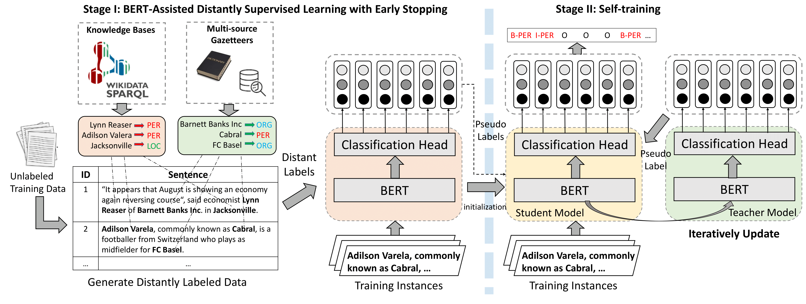

Original: https://github.com/cliang1453/BOND

## Example Greek - all of these need to be run 5 times with different seeds (--seed) for the mean and std to be reported
## 20%/80%

Step 1:

Change in code:train_dataset = load_and_cache_examples(args, tokenizer, labels, pad_token_label_id, mode="train_20")

Change in code:mode_predict = "unlabeled_train_80"

```
CUDA_DEVICE_ORDER=PCI_BUS_ID CUDA_VISIBLE_DEVICES=0 python run_ner.py --data_dir dataset/epidemic/el  --model_type xlmroberta --model_name_or_path xlm-roberta-base   --learning_rate 1e-5   --weight_decay 1e-4   --adam_epsilon 1e-8   --adam_beta1 0.9   --adam_beta2 0.98   --num_train_epochs 20   --warmup_steps 200   --per_gpu_train_batch_size 16   --per_gpu_eval_batch_size 16  --logging_steps 152  --save_steps 100000 --do_train --do_eval  --do_predict   --evaluate_during_training   --output_dir outputs/stage1_el_20   --cache_dir pretrained_model   --seed 1   --max_seq_length 128   --overwrite_output_dir
```

The code, at the end:
- predicts and prints the results for test.txt
- predicts and prints the results for unlabeled_train_80.txt (if they are labeled, scores will be printed)
This generates:
outputs/stage1_el_20/test_predictions.txt
outputs/stage1_el_20/test_predictions_unlabeled_train_80.txt

Step 2:

``` cp -r outputs/stage1_el_20/test_predictions_unlabeled_train_80.txt dataset/epidemic/el```

Change in code: weak_dataset = load_and_cache_examples(args, tokenizer, labels, pad_token_label_id, mode="test_predictions_unlabeled_train_80", remove_labels=args.remove_labels_from_weak)

Change model_name_or_path: model_name_or_path = outputs/stage1_el_20/checkpoint-best/

```
CUDA_DEVICE_ORDER=PCI_BUS_ID CUDA_VISIBLE_DEVICES=0 python run_ner.py --data_dir dataset/epidemic/el   --model_type bert --model_name_or_path outputs/stage1_el_20/checkpoint-best/   --learning_rate 1e-5   --weight_decay 1e-4   --adam_epsilon 1e-8   --adam_beta1 0.9   --adam_beta2 0.98   --num_train_epochs 20   --warmup_steps 200   --per_gpu_train_batch_size 16   --per_gpu_eval_batch_size 16   --logging_steps 87   --save_steps 1000 --do_train --do_eval   --do_predict   --evaluate_during_training   --output_dir outputs/stage2_el_20   --cache_dir pretrained_model   --seed 1   --max_seq_length 128   --overwrite_output_dir   --mt 1   --load_weak --rep_train_against_weak 1
```


## BOND- forked - Multilingual Support. https://github.com/cliang1453/BOND
This repo contains our code and pre-processed distantly/weakly labeled data for paper [BOND: BERT-Assisted Open-Domain Name Entity Recognition with Distant Supervision (KDD2020)](https://arxiv.org/abs/2006.15509)

## BOND



## Benchmark
The reuslts (entity-level F1 score) are summarized as follows:

| Method | CoNLL03 | Tweet | OntoNote5.0 | Webpage | Wikigold |
| ------ | ------- | ----- | ----------- | ------- | -------- |
| Full Supervision  | 91.21 | 52.19 | 86.20 | 72.39 | 86.43 |
| Previous SOTA | 76.00 | 26.10 | 67.69 | 51.39 | 47.54 |
| BOND | 81.48 | 48.01 | 68.35 | 65.74 | 60.07 |

- *Full Supervision*: Roberta Finetuning/BiLSTM CRF
- *Previous SOTA*: BiLSTM-CRF/AutoNER/LR-CRF/KALM/CONNET


## Data

We release five open-domain distantly/weakly labeled NER datasets here: [dataset](dataset). For gazetteers information and distant label generation code, please directly email cliang73@gatech.edu.

## Environment

Python 3.7, Pytorch 1.3, Hugging Face Transformers v2.3.0.

## Training & Evaluation

We provides the training scripts for all five open-domain distantly/weakly labeled NER datasets in [scripts](scripts). E.g., for BOND training and evaluation on CoNLL03
```
cd BOND
./scripts/epidemic_self_training.sh
```
For Stage I training and evaluation on CoNLL03
```
cd BOND
./scripts/epidemic_baseline.sh
```
The test reuslts (entity-level F1 score) are summarized as follows:

| Method | CoNLL03 | Tweet | OntoNote5.0 | Webpage | Wikigold |
| ------ | ------- | ----- | ----------- | ------- | -------- |
| Stage I| 75.61   | 46.61 | 68.11       | 59.11   | 52.15    |
| BOND   | 81.48   | 48.01 | 68.35       | 65.74   | 60.07    |


## Citation

Please cite the following paper if you are using our datasets/tool. Thanks!

```
@inproceedings{liang2020bond,
  title={BOND: Bert-Assisted Open-Domain Named Entity Recognition with Distant Supervision},
  author={Liang, Chen and Yu, Yue and Jiang, Haoming and Er, Siawpeng and Wang, Ruijia and Zhao, Tuo and Zhang, Chao},
  booktitle={ACM SIGKDD International Conference on Knowledge Discovery and Data Mining},
  year={2020}
}
```
